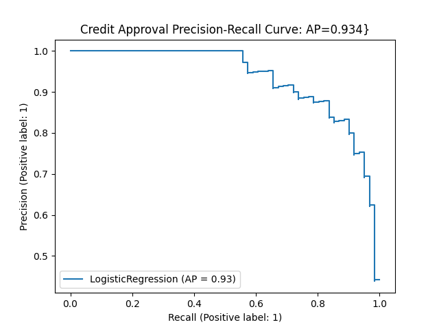

# Credit Approval

The aim was to create a machine learning model that can predict credit card approvals. The logistic regression classifier was implemented using [sklearn](https://scikit-learn.org/).



### Compiling and Running Instructions

Navigate into the ```credit``` directory:
```shell script
cd credit
```

Set up a virtual environment within the directory:
```shell script
python3 -m venv my_env
```

Activate the virtual environment:
```shell script
source my_env/bin/activate
```

Install the requirements to your virtual environment via pip:
```shell script
pip install -r requirements.txt
```

To run via ```main.py```, your command should take the following form:
```shell script
python3 main.py
```
